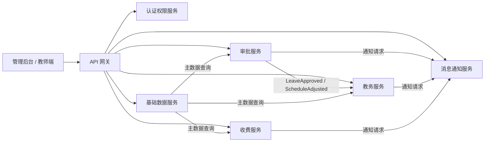

# 学校 ERP 系统

## 微服务拆分与服务边界清单

**项目名称：** 学校 ERP 系统一期建设项目  
**文档名称：** 微服务拆分与服务边界清单  
**版本号：** V1.0  
**编写日期：** 2026-04-16  
**文档状态：** 评审版  

------

# 1 引言

## 1.1 编写目的

本文档用于在总体架构说明书基础上，进一步明确学校 ERP 一期项目的服务拆分方式、服务责任范围、数据所有权、接口协作边界和禁止越界事项，为开发、联调、测试、上线和后续扩展提供统一约束。

本文档重点回答以下问题：

1. 一期到底拆几个核心服务；
2. 每个服务“负责什么、不负责什么”；
3. 哪些数据归哪个服务维护；
4. 服务之间通过什么方式协作；
5. 哪些设计方式会破坏边界，必须提前禁止。

## 1.2 适用范围

本文档适用于以下一期核心服务：

1. API 网关服务；
2. 认证权限服务；
3. 基础数据服务；
4. 教务服务；
5. 审批服务；
6. 收费服务；
7. 消息通知服务。

本文档不展开字段级数据库设计、不替代接口字段明细文档，也不覆盖二期模块的详细拆分。

## 1.3 关联文档

1. 《系统总体架构设计说明书》
2. 《数据库总体设计说明书》
3. 《接口设计规范说明书》

------

# 2 拆分原则

## 2.1 按业务域拆分

本项目采用按业务领域拆分的方式，而不是按页面、按代码层、按通用动作拆分。每个服务都必须对应一类稳定的业务能力，而不是临时的实现方便。

## 2.2 按数据所有权拆分

是否独立服务，关键看是否拥有独立数据所有权。一个服务如果不能独立维护本领域主数据或交易数据，就不算真正的领域服务。

## 2.3 按事务边界拆分

服务边界尽量与本地事务边界一致：

1. 单服务内部使用本地事务保证强一致；
2. 跨服务协作采用“同步接口 + 异步事件”组合；
3. 一期不采用重型分布式事务；
4. 禁止跨服务双写数据库。

## 2.4 按一期交付能力拆分

一期建设周期为 6 个月，强调能上线、可维护、可联调，因此采用中颗粒度微服务，不追求服务数量越多越先进。

------

# 3 服务总览

## 3.1 服务清单

| 服务名称 | 类型 | 核心定位 | 主责对象 | 数据归属 |
| --- | --- | --- | --- | --- |
| API 网关服务 | 接入层 | 统一入口与流量治理 | 路由、鉴权、限流、日志透传 | 不持有业务主数据 |
| 认证权限服务 | 核心服务 | 统一身份与权限中心 | 用户、角色、菜单、权限、会话 | 账号与权限数据 |
| 基础数据服务 | 核心服务 | 全系统主数据中心 | 学校、班级、学期、课程、教师、学生 | 主数据 |
| 教务服务 | 核心服务 | 教学运行主服务 | 排课、课表、考勤、成绩 | 教务交易数据 |
| 审批服务 | 核心服务 | 固定业务流程中心 | 请假、调课、报修、待办、流转 | 审批交易数据 |
| 收费服务 | 核心服务 | 财务收费主服务 | 费用项目、账单、收款、退费、对账 | 收费交易数据 |
| 消息通知服务 | 核心服务 | 统一消息发送中心 | 模板、发送任务、回执、重试 | 消息任务数据 |

## 3.2 逻辑关系图

------

# 4 数据所有权边界

## 4.1 主数据归属

以下数据只允许由基础数据服务维护主版本：

1. 学校、校区、学部、年级、班级；
2. 学期、节次、课程、教室；
3. 教师档案、学生档案、家长/监护人档案；
4. 统一字典和参数配置。

其他服务只能引用主键和必要快照，不能重建主版本。

## 4.2 交易数据归属

| 数据类别 | 归属服务 | 其他服务是否可写 |
| --- | --- | --- |
| 用户、角色、权限、会话 | 认证权限服务 | 不可 |
| 课表、考勤、成绩 | 教务服务 | 不可 |
| 请假单、调课单、报修单、审批任务 | 审批服务 | 不可 |
| 费用项目、账单、收款、退费、支付流水 | 收费服务 | 不可 |
| 模板、消息任务、发送日志 | 消息通知服务 | 不可 |

## 4.3 快照规则

为保证历史记录可追溯，以下场景允许保留快照：

1. 请假单中保存学生姓名、班级名称快照；
2. 调课单中保存课程名称、教师姓名、班级名称快照；
3. 账单中保存学生姓名、费用项目名称快照；
4. 成绩记录中保存学生姓名、课程名称、学期名称快照。

快照仅用于展示和审计，不替代主数据主版本。

------

# 5 服务详细边界

## 5.1 API 网关服务

### 5.1.1 负责事项

1. 统一路由转发；
2. 统一令牌基础校验；
3. 统一限流、黑白名单和跨域控制；
4. 统一注入 `requestId`、用户上下文、客户端类型；
5. 统一输出异常结构；
6. 统一记录访问日志。

### 5.1.2 不负责事项

1. 不负责业务规则判断；
2. 不负责账号密码校验逻辑；
3. 不负责业务对象状态更新；
4. 不负责跨域统计报表；
5. 不负责保存业务主数据。

## 5.2 认证权限服务

### 5.2.1 负责事项

1. 登录认证、令牌签发与刷新；
2. 用户、角色、菜单、按钮权限管理；
3. 数据权限策略管理；
4. 登录会话管理；
5. 高风险权限变更审计。

### 5.2.2 关键对象

1. 用户；
2. 角色；
3. 权限；
4. 菜单；
5. 数据范围；
6. 登录会话；
7. 登录日志。

### 5.2.3 不负责事项

1. 不维护学生、教师、课程等主档案主版本；
2. 不维护课表、审批、账单等交易状态；
3. 不直接承担消息发送逻辑；
4. 不实现教务或收费业务规则。

## 5.3 基础数据服务

### 5.3.1 负责事项

1. 维护学校、校区、年级、班级、学期、课程、教室；
2. 维护教师、学生、家长主档案；
3. 维护统一字典、统一参数；
4. 支撑批量导入导出；
5. 输出主数据查询、校验和变更事件。

### 5.3.2 边界要求

1. 其他服务不得自行维护学生或班级主版本；
2. 其他服务只保存主键和必要快照；
3. 主数据变更必须留痕；
4. 导入必须有模板、校验和错误反馈。

### 5.3.3 不负责事项

1. 不维护课表、考勤、成绩；
2. 不维护审批任务和流程状态；
3. 不维护账单和支付流水；
4. 不直接发送业务消息。

## 5.4 教务服务

### 5.4.1 负责事项

1. 排课规则配置；
2. 课表生成和调整；
3. 班级、教师、教室课表查询；
4. 学生考勤登记与统计；
5. 成绩录入、审核、发布；
6. 教学日历支撑。

### 5.4.2 依赖输入

1. 基础数据服务提供学生、教师、课程、教室、班级、学期；
2. 认证权限服务提供身份与权限上下文；
3. 审批服务提供请假通过、调课通过等结果事件。

### 5.4.3 不负责事项

1. 不审批请假和调课流程；
2. 不维护学生主档案；
3. 不直接生成收费账单；
4. 不直接调用第三方消息 SDK。

## 5.5 审批服务

### 5.5.1 负责事项

1. 请假流程；
2. 调课流程；
3. 报修流程；
4. 待办、已办、抄送中心；
5. 审批动作留痕；
6. 流程状态流转。

### 5.5.2 关键约束

1. 一期采用固定流程模板，不做复杂通用流程引擎；
2. 审批服务只负责“流程是否通过”，不负责落地教务或收费主状态；
3. 审批通过后通过事件通知下游服务。

### 5.5.3 不负责事项

1. 不直接修改考勤表、课表表；
2. 不直接修改账单状态；
3. 不承接第三方消息发送逻辑；
4. 不维护学校主数据。

## 5.6 收费服务

### 5.6.1 负责事项

1. 费用项目与收费规则管理；
2. 应收账单生成；
3. 收款登记、支付回调处理；
4. 退费处理；
5. 对账、异常核对、财务留痕。

### 5.6.2 关键约束

1. 账单状态、收款状态、退费状态只能由收费服务维护；
2. 账单中的学生和班级信息应保存快照；
3. 外部支付回调统一进入收费服务；
4. 如需退款审批，审批域只给出结果，最终账务更新仍由收费服务完成。

### 5.6.3 不负责事项

1. 不维护审批待办；
2. 不维护课表与成绩；
3. 不维护学生主档案；
4. 不直接对接第三方消息平台。

## 5.7 消息通知服务

### 5.7.1 负责事项

1. 站内信和模板消息发送；
2. 通道适配；
3. 发送任务、回执、重试管理；
4. 发送失败补偿；
5. 发送结果查询。

### 5.7.2 关键约束

1. 消息服务只负责“如何发”和“发得怎么样”；
2. 不负责“为什么发”和“是否应该发”；
3. 业务服务必须明确给出业务类型、业务主键、模板和接收人；
4. 发送失败可以重试，但不能反向修改业务单据状态。

### 5.7.3 不负责事项

1. 不读取教务或收费交易表来推断业务规则；
2. 不承载审批规则；
3. 不承载权限判定的最终逻辑。

------

# 6 跨服务协作规则

## 6.1 同步接口适用场景

同步接口适用于：

1. 主数据实时查询；
2. 权限和身份校验；
3. 前端查询和提交；
4. 轻量级校验。

约束如下：

1. 必须设置超时；
2. 必须有标准错误码；
3. 不得形成循环依赖；
4. 不得通过同步双写实现跨服务事务。

## 6.2 异步事件适用场景

异步事件适用于：

1. 审批结果驱动业务更新；
2. 账单生成、支付成功后的通知；
3. 成绩发布后的通知；
4. 报表读库同步；
5. 审计和日志异步落库。

推荐事件如下：

| 事件名称 | 发布方 | 订阅方 | 用途 |
| --- | --- | --- | --- |
| `MasterDataChanged` | 基础数据服务 | 教务、审批、收费、读库同步 | 主数据变更通知 |
| `LeaveApproved` | 审批服务 | 教务、消息通知、读库同步 | 请假通过联动考勤 |
| `ScheduleAdjusted` | 审批服务 | 教务、消息通知、读库同步 | 调课通过联动课表 |
| `BillGenerated` | 收费服务 | 消息通知、读库同步 | 新账单通知 |
| `PaymentCompleted` | 收费服务 | 消息通知、读库同步 | 支付成功通知 |
| `GradePublished` | 教务服务 | 消息通知、读库同步 | 成绩发布通知 |

------

# 7 典型场景边界说明

## 7.1 请假审批联动考勤

正确边界如下：

1. 审批服务保存请假单并流转；
2. 审批通过后发布 `LeaveApproved`；
3. 教务服务消费事件并更新考勤状态；
4. 消息服务执行通知。

错误做法如下：

1. 审批服务直接改考勤表；
2. 教务服务自行判断审批是否通过；
3. 前端一次请求同时写审批库和教务库。

## 7.2 调课审批联动课表

正确边界如下：

1. 调课申请属于审批域；
2. 课表最终变更属于教务域；
3. 审批通过后由教务服务完成课表调整；
4. 调整结果再由消息服务通知相关教师。

## 7.3 账单与支付回调

正确边界如下：

1. 账单生成和账务状态属于收费域；
2. 支付回调经网关转发至收费服务；
3. 收费服务完成幂等校验和账务更新；
4. 消息服务执行结果通知。

------

# 8 治理要求

## 8.1 研发治理

1. 每个服务必须有明确负责人；
2. 每个服务必须维护自己的接口清单；
3. 每个服务必须维护自己的数据库变更记录；
4. 每个服务必须定义关键日志和监控指标。

## 8.2 联调治理

1. 联调前先确认接口契约；
2. 同步接口和异步事件都要提供样例数据；
3. 联调问题要按边界错误、接口错误、数据错误分类；
4. 发现边界不清时，先修正文档再改代码。

## 8.3 禁止事项清单

1. 禁止跨服务直接写数据库；
2. 禁止前端绕过网关访问内部服务；
3. 禁止为方便查询直接跨库联表；
4. 禁止在消息服务中写业务规则；
5. 禁止在审批服务中写教务或收费主交易逻辑；
6. 禁止在网关层堆积业务实现代码。

------

# 9 扩展建议

二期若新增宿舍、图书、资产、人事等模块，应继续遵循以下原则：

1. 新服务必须拥有新的业务域和数据所有权；
2. 新服务必须接入统一认证与主数据体系；
3. 新服务不得侵入式修改一期核心边界；
4. 统计场景优先进入读库，而不是新增跨域联查。

------

# 10 结论

学校 ERP 一期的微服务设计目标不是“拆得多”，而是“边界稳、数据清、联调可控、后续能扩”。项目组在开发、测试和评审过程中，应始终以本文档定义的服务边界作为判断依据：谁拥有数据、谁负责规则、谁发布事件、谁不应该越界。只有边界清晰，后续数据库设计、接口设计和上线实施才能真正稳定落地。
