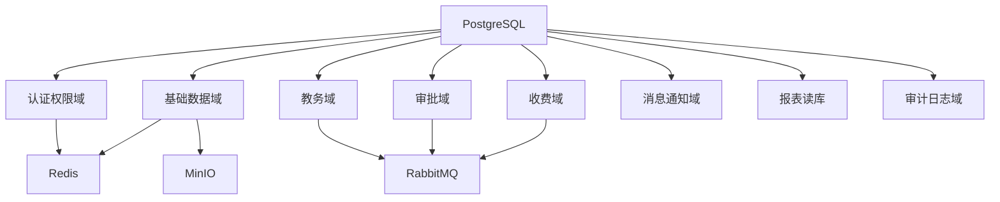

# 学校 ERP 系统

## 数据库总体设计说明书

**项目名称：** 学校 ERP 系统一期建设项目  
**文档名称：** 数据库总体设计说明书  
**版本号：** V1.0  
**编写日期：** 2026-04-16  
**文档状态：** 评审版  

------

# 1 引言

## 1.1 编写目的

本文档用于说明学校 ERP 一期项目的总体数据架构、分域策略、核心实体、主外键规范、索引原则、快照策略、缓存策略、报表读库策略以及备份恢复要求，为数据库建模、开发实现、测试验证、数据迁移和生产运维提供统一依据。

## 1.2 适用范围

本文档覆盖以下内容：

1. 认证权限域数据库设计；
2. 基础数据域数据库设计；
3. 教务域数据库设计；
4. 审批域数据库设计；
5. 收费域数据库设计；
6. 消息通知域数据库设计；
7. 报表读库、Redis、对象存储元数据设计原则；
8. 备份、归档、恢复与审计要求。

## 1.3 设计目标

本项目数据库设计目标如下：

1. 主数据统一；
2. 交易数据边界清晰；
3. 支撑多服务独立开发；
4. 支撑审计、追溯和统计；
5. 控制一期复杂度，保证半年内可落地上线；
6. 为二期模块扩展保留稳定数据边界。

------

# 2 总体数据架构

## 2.1 数据分类

本系统数据分为六类：

1. 主数据：学校、班级、课程、教师、学生、家长等；
2. 交易数据：课表、考勤、成绩、审批、账单、收款、退费等；
3. 缓存数据：会话、权限缓存、热点主数据、幂等键；
4. 文件数据：审批附件、导入模板、导出报表、图片等；
5. 统计数据：面向报表的汇总结果和宽表；
6. 日志审计数据：登录日志、操作日志、事件日志、审计日志。

## 2.2 逻辑架构图



## 2.3 环境建议

### 2.3.1 开发/测试环境

建议使用同一 PostgreSQL 实例、不同 schema 隔离：

| 域 | schema 建议 |
| --- | --- |
| 认证权限域 | `auth` |
| 基础数据域 | `master` |
| 教务域 | `academic` |
| 审批域 | `workflow` |
| 收费域 | `billing` |
| 消息域 | `notify` |
| 报表读库 | `report` |
| 审计域 | `audit` |

### 2.3.2 生产环境

建议至少做到：

1. 交易库与读库分离；
2. 收费域可独立实例或独立库；
3. Redis、RabbitMQ、MinIO 独立部署；
4. 日志与审计数据单独存放；
5. 关键库支持主从或托管高可用。

------

# 3 分域设计

## 3.1 认证权限域

### 3.1.1 业务范围

负责登录认证、角色权限、菜单模型、数据范围和登录会话。

### 3.1.2 核心表

| 表名 | 说明 |
| --- | --- |
| `auth.sys_user` | 用户主表 |
| `auth.sys_role` | 角色表 |
| `auth.sys_permission` | 权限表 |
| `auth.sys_menu` | 菜单表 |
| `auth.sys_user_role` | 用户角色关系 |
| `auth.sys_role_permission` | 角色权限关系 |
| `auth.sys_data_scope` | 数据权限策略 |
| `auth.sys_login_session` | 登录会话 |
| `auth.sys_login_log` | 登录日志 |

### 3.1.3 边界说明

1. 用户账号和权限归属本域；
2. 教师、学生的主档案不归属本域；
3. 本域中涉及组织信息时，只保存关联 ID 或快照；
4. 权限是系统级能力，业务服务只能消费，不能自行定义另一套权限主模型。

## 3.2 基础数据域

### 3.2.1 业务范围

负责全系统统一主数据，是所有交易域的基础。

### 3.2.2 核心表

| 表名 | 说明 |
| --- | --- |
| `master.md_school` | 学校表 |
| `master.md_campus` | 校区表 |
| `master.md_org_unit` | 组织层级表 |
| `master.md_grade` | 年级表 |
| `master.md_class` | 班级表 |
| `master.md_term` | 学期表 |
| `master.md_period` | 节次表 |
| `master.md_course` | 课程表 |
| `master.md_classroom` | 教室表 |
| `master.md_teacher` | 教师表 |
| `master.md_student` | 学生表 |
| `master.md_guardian` | 监护人表 |
| `master.md_student_guardian_rel` | 学生监护人关系表 |
| `master.md_dict_type` | 字典类型表 |
| `master.md_dict_item` | 字典项表 |
| `master.md_import_batch` | 导入批次表 |

### 3.2.3 边界说明

1. 学生、教师、班级、课程、学期等主版本只能在本域维护；
2. 其他服务只能引用 ID 和快照；
3. 主数据导入、校验、唯一性规则统一在本域实现；
4. 本域不维护课表、审批、账单等交易数据。

## 3.3 教务域

### 3.3.1 业务范围

负责教学运行核心交易数据：排课、课表、考勤、成绩、教学日历。

### 3.3.2 核心表

| 表名 | 说明 |
| --- | --- |
| `academic.ac_schedule_rule` | 排课规则 |
| `academic.ac_timetable` | 课表主表 |
| `academic.ac_timetable_entry` | 课表明细 |
| `academic.ac_schedule_adjustment_log` | 调整留痕 |
| `academic.ac_attendance_record` | 考勤记录 |
| `academic.ac_attendance_daily_summary` | 考勤日汇总 |
| `academic.ac_grade_task` | 成绩任务 |
| `academic.ac_grade_record` | 成绩明细 |
| `academic.ac_grade_publish_log` | 成绩发布日志 |
| `academic.ac_teaching_calendar` | 教学日历 |

### 3.3.3 边界说明

1. 课表、考勤、成绩主状态只能由教务域维护；
2. 请假和调课审批结果由审批域输出，但最终教务状态由本域落地；
3. 本域不维护学生、课程、教室主档案；
4. 历史展示需要的姓名、班级名、课程名允许保留快照。

## 3.4 审批域

### 3.4.1 业务范围

负责固定流程模板、流程实例、任务、审批动作和过程留痕。

### 3.4.2 核心表

| 表名 | 说明 |
| --- | --- |
| `workflow.wf_process_template` | 固定流程模板 |
| `workflow.wf_process_instance` | 流程实例主表 |
| `workflow.wf_process_task` | 待办任务表 |
| `workflow.wf_process_action_log` | 审批动作日志 |
| `workflow.wf_leave_form` | 请假单 |
| `workflow.wf_schedule_change_form` | 调课单 |
| `workflow.wf_repair_form` | 报修单 |
| `workflow.wf_process_cc` | 抄送记录 |

### 3.4.3 边界说明

1. 审批域维护流程状态，不维护下游业务主状态；
2. 审批单可以保存主数据快照；
3. 审批通过后通过事件驱动教务或收费服务更新状态；
4. 本域不直接修改课表表、账单表。

## 3.5 收费域

### 3.5.1 业务范围

负责费用项目、账单、收款、支付回调、退费和对账。

### 3.5.2 核心表

| 表名 | 说明 |
| --- | --- |
| `billing.bl_fee_item` | 费用项目 |
| `billing.bl_billing_rule` | 收费规则 |
| `billing.bl_bill` | 账单主表 |
| `billing.bl_bill_detail` | 账单明细 |
| `billing.bl_receipt` | 收款记录 |
| `billing.bl_payment_txn` | 支付流水 |
| `billing.bl_refund_order` | 退费单 |
| `billing.bl_reconciliation_task` | 对账任务 |

### 3.5.3 边界说明

1. 账单和账务状态只能在收费域维护；
2. 支付回调统一进入收费域；
3. 学生、班级、学期等只引用主数据；
4. 退费审批如果存在，只由审批域给出审批结果，本域负责最终账务更新。

## 3.6 消息通知域

### 3.6.1 业务范围

负责模板、消息任务、接收人明细、回执和重试记录。

### 3.6.2 核心表

| 表名 | 说明 |
| --- | --- |
| `notify.nt_message_template` | 模板表 |
| `notify.nt_message_task` | 发送任务表 |
| `notify.nt_message_recipient` | 接收人明细 |
| `notify.nt_channel_config` | 渠道配置 |
| `notify.nt_send_log` | 发送日志 |
| `notify.nt_retry_log` | 重试日志 |

### 3.6.3 边界说明

1. 消息域负责发送过程，不负责业务规则；
2. 发送记录由本域维护；
3. 收件人基础信息不是本域主档案；
4. 发送失败可重试，但不能反向改变业务单据状态。

## 3.7 报表读库

报表读库用于承接：

1. 学生收费汇总；
2. 班级考勤统计；
3. 成绩发布统计；
4. 审批效率统计；
5. 消息发送统计。

约束如下：

1. 只读；
2. 通过事件或定时同步入库；
3. 不承接业务主交易写入；
4. 不允许直接拿读库结果回写交易状态。

------

# 4 主键、公共字段与命名规范

## 4.1 主键设计

建议采用“技术主键 + 业务编码”双轨方案：

1. 技术主键统一使用 `bigint`；
2. 业务编码用于展示和对外对接，例如 `studentNo`、`billNo`、`processNo`；
3. 技术主键不携带业务语义；
4. 业务编码应具备唯一性和可搜索性。

## 4.2 通用审计字段

业务表建议统一包含以下字段：

| 字段名 | 说明 |
| --- | --- |
| `id` | 技术主键 |
| `created_by` | 创建人 |
| `created_at` | 创建时间 |
| `updated_by` | 更新人 |
| `updated_at` | 更新时间 |
| `version_no` | 乐观锁版本号 |
| `is_deleted` | 逻辑删除标记 |
| `remark` | 备注 |

## 4.3 状态字段规范

状态字段应明确表达业务语义，不允许多个真假字段拼凑状态。

示例：

| 对象 | 状态字段 | 建议值 |
| --- | --- | --- |
| 审批实例 | `process_status` | `DRAFT`、`IN_REVIEW`、`APPROVED`、`REJECTED` |
| 账单 | `bill_status` | `PENDING`、`PARTIAL_PAID`、`PAID`、`CLOSED` |
| 成绩任务 | `publish_status` | `DRAFT`、`AUDITING`、`PUBLISHED` |

## 4.4 金额与时间字段

1. 金额统一使用 `numeric(18,2)`；
2. 不使用浮点类型存储金额；
3. 时间统一使用 `timestamp`；
4. 业务日期与操作时间分开建模。

------

# 5 快照、一致性与幂等设计

## 5.1 快照设计

以下表建议保留快照字段：

| 场景 | 快照字段建议 |
| --- | --- |
| 请假单 | `student_name_snapshot`、`class_name_snapshot` |
| 调课单 | `course_name_snapshot`、`teacher_name_snapshot` |
| 账单 | `student_name_snapshot`、`fee_item_name_snapshot` |
| 成绩记录 | `student_name_snapshot`、`course_name_snapshot`、`term_name_snapshot` |

快照规则：

1. 只在业务发生时写入；
2. 只用于展示和审计；
3. 不替代主数据主版本；
4. 不应被后续主数据变更覆盖。

## 5.2 单服务一致性

单服务内部统一采用本地事务。例如：

1. 成绩任务和成绩明细一起提交；
2. 审批单和待办任务一起提交；
3. 账单主表和账单明细一起提交；
4. 消息任务和接收人明细一起提交。

## 5.3 跨服务一致性

跨服务采用最终一致性：

1. 源服务先提交本地事务；
2. 源服务发布业务事件；
3. 下游服务消费事件更新本地状态；
4. 消费失败通过重试、死信或人工补偿处理；
5. 消费端必须幂等。

## 5.4 幂等记录

以下场景必须设计幂等：

1. 审批提交；
2. 账单生成；
3. 支付回调；
4. 退费确认；
5. 导入任务提交；
6. 消息发送任务创建。

推荐使用：

1. 数据库唯一索引；
2. 幂等记录表；
3. Redis 幂等键；
4. 事件消费日志。

------

# 6 索引与性能设计

## 6.1 索引原则

1. 每张表必须有主键索引；
2. 业务编码字段必须有唯一索引；
3. 高频查询字段建立组合索引；
4. 大日志表控制索引数量；
5. 排序字段必须与查询路径匹配。

## 6.2 典型索引建议

| 表 | 索引建议 | 用途 |
| --- | --- | --- |
| `master.md_student` | `(student_no)` 唯一索引 | 按学号查学生 |
| `master.md_student` | `(class_id, status)` | 班级学生列表 |
| `academic.ac_timetable_entry` | `(term_id, class_id, weekday, period_id)` | 课表查询 |
| `academic.ac_attendance_record` | `(biz_date, class_id)` | 日考勤统计 |
| `workflow.wf_process_task` | `(assignee_id, task_status, created_at)` | 待办列表 |
| `billing.bl_bill` | `(student_id, bill_status, due_date)` | 学生账单列表 |
| `notify.nt_message_task` | `(biz_type, biz_id)` | 业务消息回查 |

## 6.3 慢查询控制

1. 报表统计优先走读库；
2. 高频列表必须分页；
3. 深分页建议用游标或主键翻页；
4. 大批量导出采用异步任务；
5. 关键 SQL 必须走执行计划评审。

------

# 7 Redis、文件与读库设计

## 7.1 Redis 适用场景

1. 登录会话缓存；
2. 角色权限缓存；
3. 热点主数据缓存；
4. 幂等键和限流计数；
5. 异步任务状态缓存。

Key 命名建议：

```text
school-erp:{service}:{bizType}:{bizKey}
```

## 7.2 文件元数据设计

对象存储用于以下文件：

1. 审批附件；
2. 报修图片；
3. 导入模板与导入结果文件；
4. 导出报表。

数据库中应保存元数据，建议至少包含：

1. 文件 ID；
2. 业务类型；
3. 业务主键；
4. 原始文件名；
5. 对象键；
6. 文件大小；
7. 上传人；
8. 上传时间；
9. 是否私有；
10. 失效时间。

## 7.3 报表读库同步

推荐“事件同步 + 定时修正”组合模式：

1. 审批通过、账单生成、支付成功、成绩发布等走事件同步；
2. 每日定时任务做增量校正；
3. 读库宽表只做查询和统计，不回写业务状态。

------

# 8 数据安全、迁移与备份恢复

## 8.1 敏感数据要求

以下数据属于敏感数据：

1. 用户密码；
2. 手机号；
3. 身份证号；
4. 家长联系方式；
5. 收费金额和支付流水；
6. 学生成绩；
7. 审批意见。

要求如下：

1. 密码必须加密存储；
2. 敏感字段按权限脱敏展示；
3. 导出记录必须审计；
4. 备份文件必须加密。

## 8.2 数据迁移要求

一期迁移重点包括：

1. 组织结构；
2. 学期、课程、教室；
3. 教师、学生、家长；
4. 必要的账号和角色关系；
5. 收费基础数据。

迁移流程建议：

1. 数据盘点；
2. 字段映射；
3. 格式校验；
4. 业务校验；
5. 错误反馈；
6. 修正重导；
7. 正式入库；
8. 抽样核对。

## 8.3 备份与恢复

1. 核心交易库每日全量备份；
2. 关键库支持增量归档；
3. 对象存储关键桶每日快照；
4. Redis 持久化文件定期备份；
5. 必须形成恢复手册并定期演练。

------

# 9 结论

本系统数据库总体设计采用“按服务分域、主数据统一、交易数据分治、快照追溯、读库承压、缓存协同、审计可追溯”的总体思路。该方案既能满足学校 ERP 一期的快速落地要求，又能为后续二期扩展保留清晰的数据边界和演进空间。后续字段级详细建模、DDL 编写和迁移脚本设计都应以本文档为统一约束。
